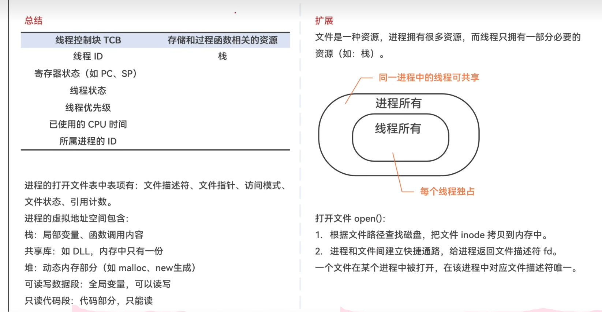

## 2.1 进程与线程 — 思维导图

### 一、进程的概念

#### 程序 vs 进程
- **程序**：静态的，存放在磁盘的可执行文件（就是一个指令序列）
- **进程**：动态的，程序的一次执行过程
- 同一个程序多次执行 → 对应多个进程

#### 进程的组成（进程映像 / 进程实体）
```
进程 = PCB + 程序段 + 数据段
 ├── PCB（进程控制块）：给OS用，进程**唯一标志**
 ├── 程序段：给进程自己用，代码（指令序列），存低地址
 └── 数据段：给进程自己用，运行中的变量数据，存高地址
```
- 创建进程 = 创建进程实体中的 **PCB**
- PCB 是进程存在的**唯一标志**

#### PCB 核心内容
| 类别 | 内容 |
|------|------|
| **进程描述信息** | PID（唯一标识）、UID（用户标识符）|
| **进程控制和管理信息** | 进程当前状态、优先级 |
| **资源分配清单** | 文件、内存、I/O设备 |
| **处理机相关信息** | PSW、PC（程序计数器）、各种寄存器值 |

> 进程切换时，当前运行情况必须保存到 PCB 中，如 PC 值表示执行到哪一句

#### 进程的组织方式
- **链接方式**：按进程状态将 PCB 分为多个队列（就绪队列、阻塞队列），OS 持有指向各队列的指针
- **索引方式**：根据进程状态建立几张索引表，OS 持有指向各索引表的指针

#### 进程的特征
| 特征 | 说明 |
|------|------|
| **动态性** | **最基本特征**，进程动态产生、变化、消亡 |
| **并发性** | 多个进程实体可并发执行 |
| **独立性** | 独立运行、独立获得资源、独立接受调度 |
| **异步性** | 不可预知速度推进 → 需要**进程同步机制** |
| **结构性** | 每个进程配一个 PCB |

---

### 二、进程的状态与转换

#### 五种状态
```
创建态 → 就绪态 → 运行态 → 终止态
              ↑       ↓
              └── 阻塞态
```

| 状态 | 说明 |
|------|------|
| **创建态（New）** | 分配资源、初始化PCB（分配PID等） |
| **就绪态（Ready）** | 万事俱备，只欠CPU（已具备除CPU外所有资源）|
| **运行态（Running）** | 占有CPU并运行（单核CPU每时刻最多一个）|
| **阻塞态（Blocked）** | 等待事件/资源（等待态）|
| **终止态（Terminated）** | 回收资源、撤销PCB |

#### 状态转换核心
| 转换 | 触发 |
|------|------|
| 无 → 创建态 | 创建进程：分配资源、初始化PCB |
| 创建态 → 就绪态 | 系统完成创建进程 |
| 就绪态 → 运行态 | **被调度**（获得CPU）|
| 运行态 → 就绪态 | 时间片到 / 被抢占 |
| 运行态 → 阻塞态 | 等待资源 / 事件（**主动**）|
| 阻塞态 → 就绪态 | 资源到位 / 事件发生（**被动**）|
| 运行态 → 终止态 | 运行结束 / 错误 |

> 💡 不能：阻塞态 → 直接 → 运行态；就绪态 → 直接 → 阻塞态

---

### 三、进程控制

#### 原语（原子操作）
- 实现进程控制，**实现进程状态的转换**
- 特点：执行期间不允许被中断，只能一气呵成
- 通过 **关中断 / 开中断** 实现
- 关/开中断是权限非常大的**特权指令**，必须在核心态执行

#### 核心原语
| 原语 | 过程 |
|------|------|
| **创建原语** | 申请空PCB → 分配资源 → 初始化PCB → 插入就绪队列 |
| **撤销原语** | 找PCB → 剥夺CPU → 终止子进程 → 回收资源 → 删除PCB |
| **阻塞原语** | 保护运行现场 → 设阻塞态 → 插入等待队列 |
| **唤醒原语** | 找PCB → 移出等待队列 → 设就绪态 → 插入就绪队列 |
| **切换原语** | 保存环境 → 移入相应队列 → 选新进程 → 恢复环境 |

**原语执行三步**：
1. 更新 PCB 信息（改状态标志，保存/恢复运行环境）
2. 将 PCB 插入合适队列
3. 分配/回收资源

> ⚠️ 阻塞原语和唤醒原语**必须成对使用**

---

### 四、进程通信（IPC）

进程间内存地址空间相互独立，一个进程不能直接访问另一个进程的地址空间

| 方式 | 特点 | 细节 |
|------|------|------|
| **共享存储** | 基于数据结构（低级）或基于存储区（高级）| 需互斥访问 |
| **消息传递** | 以格式化消息为单位交换数据 | 直接通信（挂到PCB消息队列）或间接通信（信箱）|
| **管道通信** | 半双工，互斥访问，FIFO | 见下方详细规则 |

**管道通信详细规则**：
1. 管道只能**半双工通信**，某一时间段只能单向传输；双向需两个管道
2. 各进程要**互斥地访问**管道
3. 数据以字符流形式写入，写满时写进程 **write() 被阻塞**，等待读进程取走
4. 没写满**不允许读**，没读空**不允许写**（Linux 无此规定）
5. 数据一旦被读出就从管道中**被抛弃** → 读进程最多只有一个

---

### 五、线程

#### 引入线程的目的
- 传统进程只能串行执行一系列程序
- 引入线程后，同一进程的各线程可以并发执行
- 进程内各线程共享进程资源

#### 引入线程后的变化
```
引入前：进程 = 资源分配 + 调度（双角色）
引入后：进程 = 资源分配基本单位
        线程 = 调度基本单位（CPU执行的最小单位）
```

#### 线程的属性
| 属性 | 说明 |
|------|------|
| 调度单位 | 线程是处理机调度的基本单位 |
| 多CPU | 各线程可占用不同 CPU |
| 控制块 | 每个线程有线程ID、TCB |
| 状态 | 就绪态、运行态、阻塞态三种基本状态 |
| 资源 | 线程几乎不拥有系统资源 |
| 资源共享 | 同一进程的不同线程共享进程资源 |
| 通信 | 同一进程线程间通信无需系统干预 |
| 切换开销 | 同进程内线程切换很小；不同进程线程切换大 |

#### 线程的实现方式

| 类型 | 管理方 | 特点 |
|------|--------|------|
| **用户级线程** | 线程库（应用程序）| 切换在用户态完成，无需OS干预；OS意识不到线程存在；一个阻塞→整个进程阻塞 |
| **内核级线程** | 操作系统内核 | 切换必须在核心态；内核级线程才是处理机分配的单位；一个阻塞不影响其他 |

#### 多线程模型
| 模型      | 映射        | 优点             | 缺点             |
| -----| --------- | -------------- | -------------- |
| 多对一 | n用户级→1内核级 | 切换快，效率高        | 一个阻塞→全阻塞，并发度不高 |
| 一对一 | 1用户级→1内核级 | 并发度高，一个阻塞不影响其他 | 切换开销大，成本高      |
| 多对多 | n用户级→m内核级 | 兼具二者优点         | 实现复杂           |

